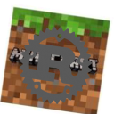

<div align="center">
  
<br>
[](https://discord.gg/kJR97sc6AT)


</div>
---


## About
rustcraft is not a minecraft clone looking for feature parity, and is instead a minecraft inspired game.

## Installation
[Rust](https://rust-lang.org) must be installed
```bash
git clone git@github.com:AbleTheAbove/rustcraft.git && cd rustcraft && cargo run --release
```

## Contributing
Pull requests are welcome. For major changes, please open an issue first to discuss what you would like to change.

Please be sure to add relevant TODO/INFO/NOTE's to keep our code readable!
